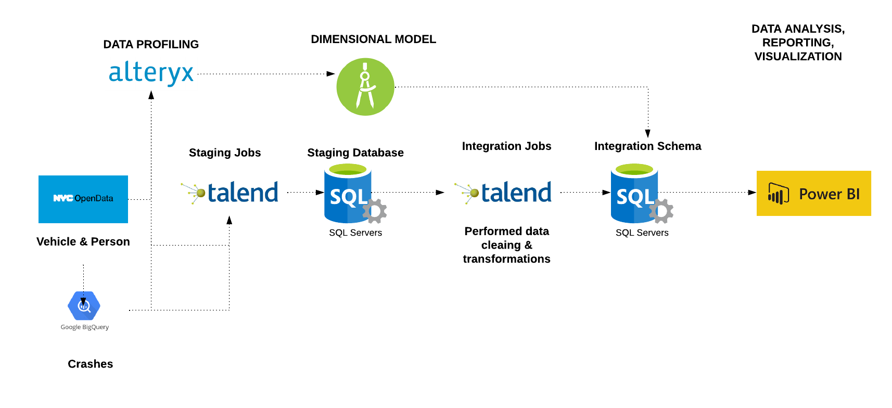
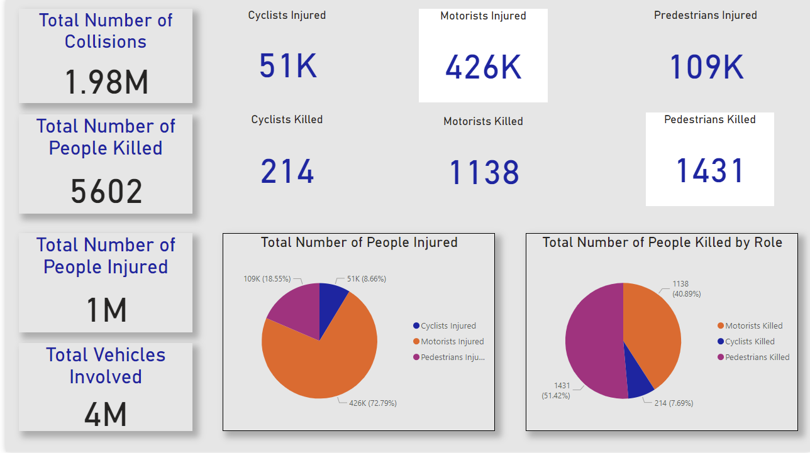
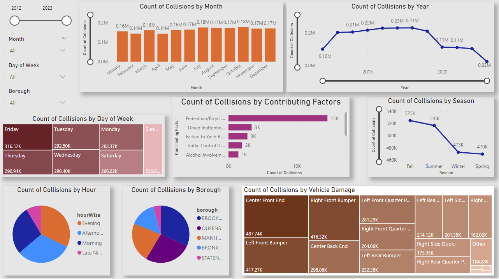

# ETL and Analysis : Motor Vehicle Collision

## Research question or challenge
The project aims to investigate and analyze the patterns, causes, and consequences of motor vehicle collisions in New
York City. The primary research questions were: What are the key factors contributing to motor vehicle collisions in
In NYC, where are the most dangerous spots? When do most collisions occur? and how can this information be used to
enhance road safety and reduce the frequency of accidents?

## Approach and methodology
 

	  

### Data Profiling: 
The first step involves understanding the characteristics and quality of the available data sources. This includes examining the data for completeness, accuracy, consistency, and identifying any potential
quality issues using Alteryx and Python’s Pandas profiling library.

### Data Integration and Staging: 
Three datasets—person, vehicle and crashes—are integrated from diverse sources and
staged for analysis. Data integration ensures that relevant information is consolidated for a holistic view of
vehicle collisions in NYC. Vehicles & Person Dataset was extracted from NYC Open Data & Crashes dataset was
integrated from GCP Big Query into staging database.

### Dimensional Model: 

Designed a dimensional data model to organize and structure the data for analysis. This simplified complex data relationships, making it easier to analyze and
extract insights.

 

	  

### Data Cleaning & Integration: 

Data cleaning was crucial to ensuring accuracy and reliability; this involved
identifying and addressing missing, duplicate, and inconsistent values.

1. Null values were replaced with “No Value Provided” in all the dimensions, keeping -99 as SK.
2. Redundant directions in Travel_Direction were changed to a homogeneous format and Person_Age with Negative or large values have been replaced with 0
3. Vehicle_Year with nulls and values less than 1900 or greater than 2023 with 9999
4. vehicle_type_code, vehicle_make, vehicle_model, and vehicle_year with corrected data since these have large
number of discrepancies.
5. Driver_License_Jurisdiction and State_Registration (Vehicle) format was maintained with a two-character format and invalid inputs such as
Special characters, for example “-“, "PA'", etc., were corrected or replaced with “Invalid Input”.

## Questions Answered
- How Many Car Accidents Are There in NYC Every Year?
- Which Boroughs in New York City Have the Most Accidents?
- How Many NYC Car Accidents Result in an Injury?
- Which NYC Borough Has the Most Fatal Car Accidents?
- When Do Most New York City Car Accidents Happen?
- How Common Are Bicycle Accidents in NYC?
- How Often Are Pedestrians Involving New York Traffic Accidents?
- How Many Motorcyclists are Injured or Killed in NYC Accidents?
- Are Trucks Involved in Many New York Accidents?

## Visualizations 

### Metrics:
1. number of collisions
2. number of people injured or died
3. number of people by role, such as pedestrian, injured or died
4. number of vehicles involved

 

	  

### Dimensions: 
1. Trend (granularity month, year), also seasonality, i.e., Spring, Summer, Fall and Winter
2. Annual statistics
3. Time of day (hour granularity), note you can band hours together for such things as morning
commute, evening commute, late night, etc.
4. Vehicle types (for the time period data is available)
5. Collision causes
   
### Collision Analysis: 
This was done to reveal top causes that led to collisions and fatalities

### Time Series Analysis: 
Reveal what time of day, day of week, weekday/weekend have most collisions

### Fatality Analysis: 
This revealed that pedestrians were killed more often than other road users whenever collisions occurred

 

	  

 

	  

 

	  

## Findings and their significance
1. Identification of High-Risk Areas: The analysis pinpoints specific areas and intersections with a high frequency of
collisions. This information can be used by city planners and traffic engineers to implement safety measures and
infrastructure improvements.
2. Contributing Factors: The study identifies contributing factors to collisions, such as weather conditions, time of day,
and driver behaviour. This knowledge is crucial for targeted education campaigns and enforcement efforts to
improve road safety.
3. Seasonal Trends: Seasonal trends in collision rates are identified, allowing authorities to allocate resources more
effectively during high-risk periods.
4. Vehicle Type Analysis: The data reveals patterns related to the types of vehicles involved in collisions. This
Information can guide regulations and safety measures for specific vehicle categories.

The significance of these findings lies in their potential to inform evidence-based decision-making and interventions to
reduce motor vehicle collisions and improve road safety in New York City. By understanding the causes and patterns of
collisions, policymakers, law enforcement, and city planners can work together to create safer streets and protect the
lives of residents and visitors.
